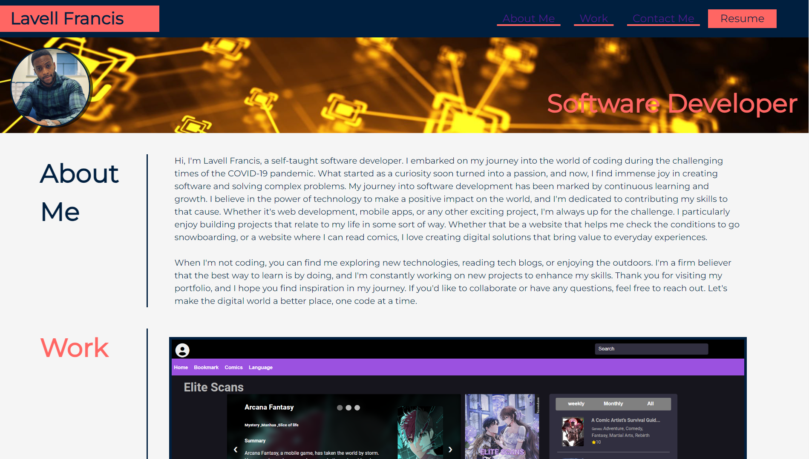
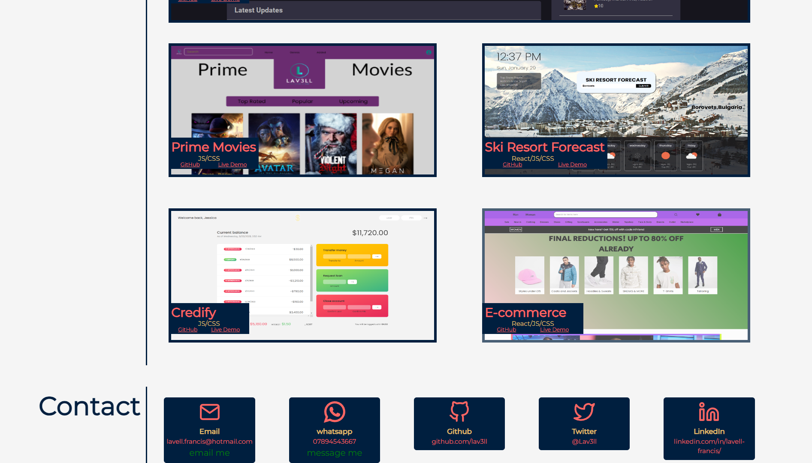

# lavell-portfolio

A portfolio showcasing my work and skills

## Description

This is my personal project portfolio, showcasing a collection of web development projects I've created. From web applications and mobile apps to websites and more, explore my work and journey as a self-taught software developer. Each project comes with details, source code links, and live demos, providing a glimpse into my skills and passion for coding. Thank you for visiting my portfolio, and feel free to reach out for collaboration or any questions."

## Installation

No installation needed

[Click here to see live copy of the site](https://lav3ll.github.io/lavell-portfolio/)

[Link to lavell-portfolio](https://github.com/lav3ll/lavell-portfolio)

## Usage

- Each button on the top of the page leads to the relevant location on the site.

* The Resume button will allow you to download a copy of my CV.

- The links to the left of each project image will take you to the live site or the github repository for the site depending on which link you take.

- The yellow writing below each project name shows the language the code was written in and library used if one had been used.

- Clicking on the green **"email me"** text will open up your email application with my email as the recipient.

* Clicking on the green **"message me"** text next to the whatsapp icon will open whatsapp with my phone number ready to message.

* All icons can be clicked on to go to the link in the caption beneath it.

**Website Overview:** This is my software development portfolio, where I showcase a diverse collection of projects I've created. From web applications to mobile apps and more, explore my work and skills as a developer, and feel free to reach out for collaboration or inquiries.

**Key Features:** Projects

**Goals and Results:** To assist with breaking into the software developer career pathway.

**Explore Resources:**
https://ionic.io/ionicons [Free Icons - I used this for my contact me section]
https://coolors.co/ [Helped me with picking a colour scheme for my portfolio]
https://fonts.google.com/ [Main font for most of the text on site]

## Credits

Skills For Life
Ed X

## License

MIT License

Skills For Life
Ed X
